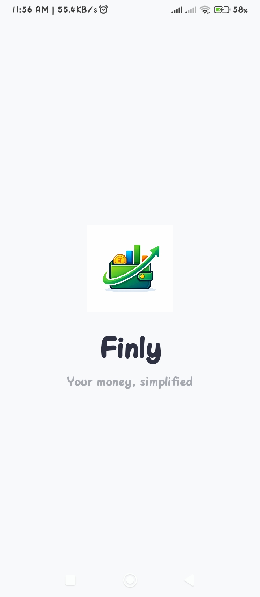
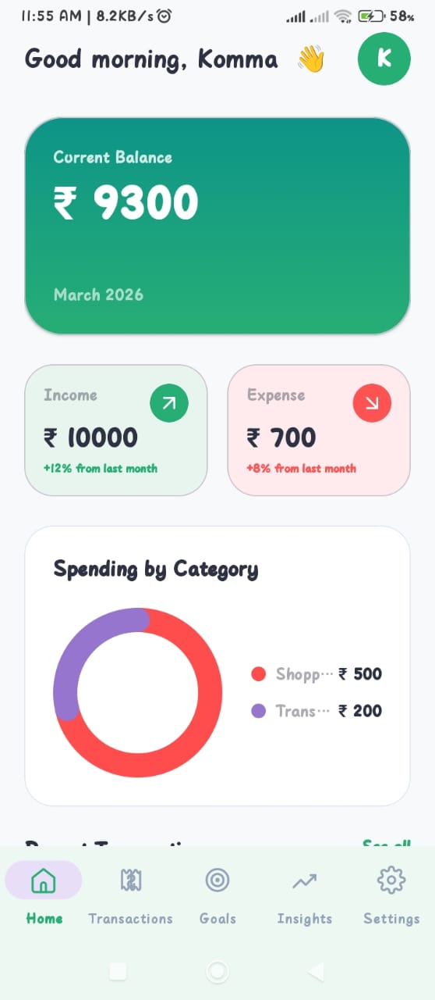
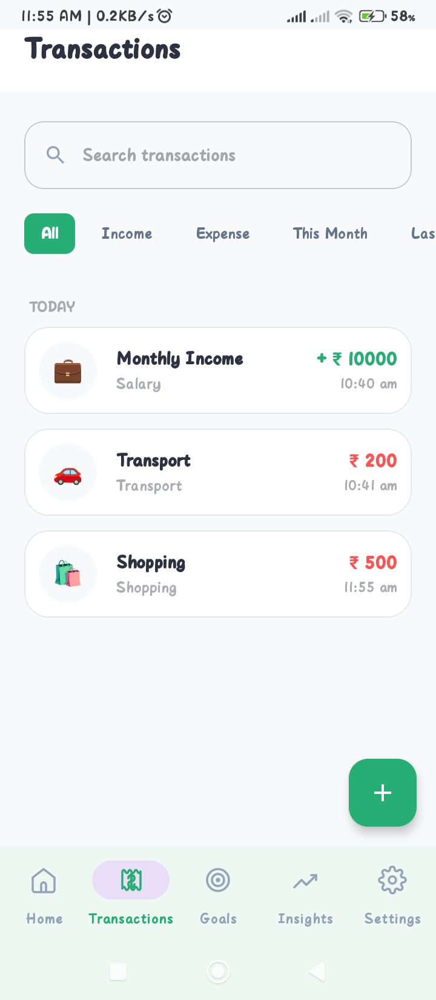
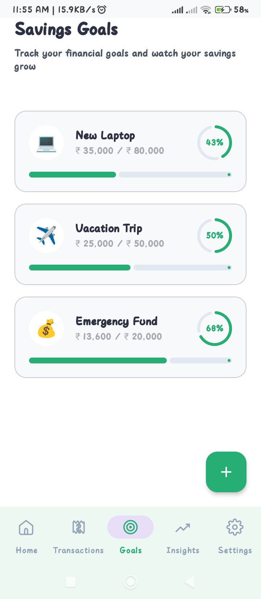
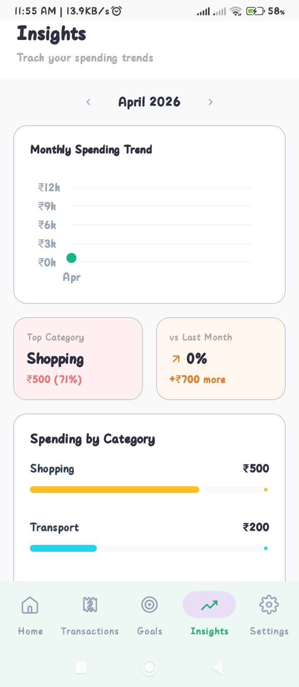
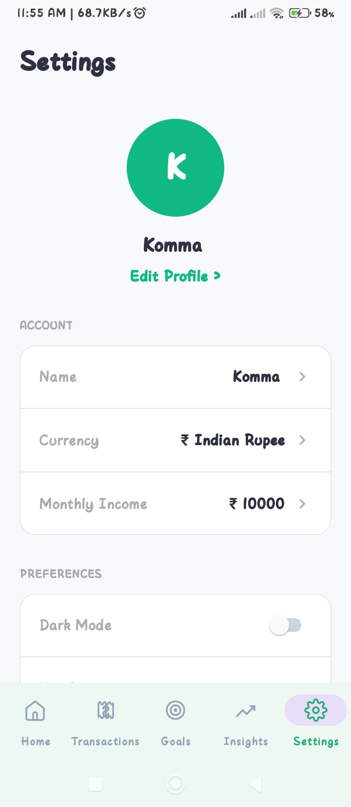

# 💰 Finly – Smart Expense Tracker App

> A modern, offline-first expense tracking Android app built using **Kotlin, MVVM, and Room Database** to help users manage their finances efficiently.

---

## 📱 Features

* 📊 **Track Expenses & Income**
* 🎯 **Set Financial Goals**
* 📈 **Insights & Analytics Dashboard**
* 🔔 **Smart Alerts (Weekly Comparison & Trends)**
* 🔐 **Biometric Authentication (Fingerprint/Face Unlock)**
* ⚡ **Offline-First (Works without Internet)**
* 🧹 **Clear All Data Option**
* 🎨 **Clean & Modern UI (Material Design)**

---

## 🏗️ Architecture

This app follows **MVVM (Model-View-ViewModel)** architecture:

* **UI (Activity/Fragment)** → Displays data
* **ViewModel** → Handles UI logic
* **Repository** → Data operations
* **Room Database** → Local storage

---

## 🛠️ Tech Stack

* **Language:** Kotlin
* **Architecture:** MVVM
* **Database:** Room Database
* **UI:** XML + Material Design
* **State Management:** LiveData
* **Security:** Biometric Authentication

---

## 📸 Screenshots

>

* 🏠 Home Screen
* 💳 Transactions Screen
* 🎯 Goals Screen
* 📊 Insights Screen

---

## 🚀 Getting Started

### Prerequisites

* Android Studio installed
* Minimum SDK: 21+

### Installation

```bash
git clone https://github.com/balukomma/Finly-App.git
```

Open the project in **Android Studio** and run the app.

---

## 📂 Project Structure

```
Finly/
│── app/
│   ├── data/ (Room DB, DAO, Entities)
│   ├── repository/
│   ├── viewmodel/
│   ├── ui/ (Activities & Fragments)
│   └── utils/
│
│── gradle/
│── README.md
```

---

## 🔮 Future Enhancements

* ☁️ Cloud Sync (Firebase)
* 📊 Advanced Charts & Reports
* 🌙 Dark Mode
* 💰 Budget Planning Feature

---

## 👨‍💻 Author

**Komma Bala Bhaskar**

* 💼 Aspiring Software Developer
* 🚀 Passionate about Android & Backend Development

---

## ⭐ Show Your Support

If you like this project:

* ⭐ Star this repo
* 🍴 Fork it
* 📢 Share with others

---

## 📌 Note

This project is built for **learning and demonstration purposes** as part of an Android development portfolio.

---
